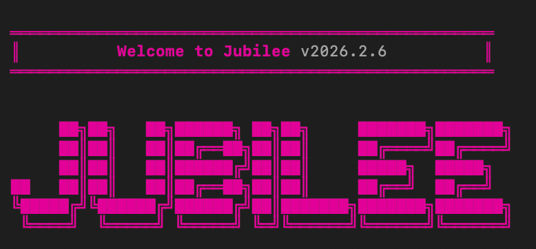

# Jubilee 🕊️



Jubilee is an autonomous AI agent built on a **Triune Architecture** (The Mind, The Prophet, The Will). It generalizes the agentic loop to handle financial research, coding tasks, and system operations while integrating biblical wisdom and [OpenClaw](https://openclaw.ai) capabilities.

> **Attribution**: This project is built upon the excellent [Dexter](https://github.com/virattt/dexter) framework by [Virat](https://twitter.com/virattt). We gratefully acknowledge their work as the foundation for Jubilee.

## The Triune Agent Architecture

Jubilee operates through three distinct sub-agents that work in concert:

1.  **The Mind 🧠**: Analytical, logical, and data-driven. It has access to **read-only tools** (Search, Browser, Financial Metrics) to break down problems and find facts without risking system state.
2.  **The Prophet 👁️**: Intuitive, forward-looking, and strategic. It uses the same **read-only tools** to identify trends and "the bigger picture."
3.  **The Will ⚡**: The executor. It synthesizes insights and has **full tool access** (including OpenClaw and trading) to execute the final plan.

Every session begins and ends with a guiding verse, grounding the agent's operation in wisdom.

## Features

-   **Interactive Setup**: Automatically detects your AI provider (OpenAI, Anthropic, Google, etc.) and prompts for API keys if missing.
-   **OpenClaw Integration**: Can delegate system-level tasks to a local [OpenClaw](https://github.com/openclaw/openclaw) instance.
-   **Hosts Mode ("The Lord of Hosts")**: "The Will" can dispatch specialized sub-agents ("Angels") for parallel, isolated tasks (e.g., "Research Angel", "Coder Angel").
-   **Treasury ("The Almoner")**: Integrated with [Coinbase AgentKit](https://docs.cdp.coinbase.com/agentkit/docs/welcome) for on-chain asset management and transfers.
-   **Multi-Model Support**: Switch between GPT-4, Claude 3.5 Sonnet, Gemini Pro, and more on the fly.
-   **Self-Correction**: The agent reflects on its own output and iterates to improve warranty.

## ✅ Prerequisites

-   [Bun](https://bun.com) runtime (v1.0 or higher)
-   An API key for your preferred LLM provider (Google Gemini, OpenAI, Anthropic, etc.)
-   (Optional) Coinbase CDP API Key for Treasury features

## 💻 Installation

1.  Clone the repository:
    ```bash
    git clone https://github.com/jubilee-protocol/jubilee-agent.git
    cd jubilee-agent
    ```

2.  Install dependencies:
    ```bash
    bun install
    ```

## 🚀 Usage

Start the interactive agent:

```bash
bun start
```

1.  **Select Provider**: Choose your AI provider from the list.
2.  **Select Model**: Pick the model you want to use.
3.  **Chat**: Enter your query (e.g., "Analyze the market", "Write a Python script", "Ask OpenClaw to check my logs").

## 🕊️ Hosts Mode ("The Lord of Hosts")

Jubilee can scale its attention by dispatching specialized sub-agents called **Angels**.
-   **Concept**: Uses the `dispatch_angel` tool to spawn a temporary, single-purpose agent.
-   **Capabilities**: Angels can be equipped with specific tools (e.g., "web_search", "skill") and a mission.
-   **Usage**: "The Will" automatically decides when to use this for complex, multi-step tasks.

## 💰 The Almoner (Treasury)

Jubilee manages on-chain assets via the **Coinbase Developer Platform (CDP) AgentKit**.
-   **Capabilities**: Check balances, transfer assets (ETH, USDC), and interacting with contracts on **Base Mainnet**.
-   **Configuration**: Requires a CDP API Key with "Server-Signer" (Wallet) privileges.
    1.  Create an API Key on [CDP Portal](https://portal.cdp.coinbase.com/).
    2.  Enable "Wallet" service for your project.
    3.  Add `CDP_API_KEY_ID`, `CDP_API_KEY_SECRET`, and `CDP_WALLET_SECRET` to `.env`.
    *Tip: Use `bun scripts/generate-secret.ts` to create a secure Wallet Secret.*


## � The Confessional (Local Memory)

Jubilee features a privacy-first memory system stored locally:
-   **Storage**: [LanceDB](https://lancedb.com) (Vector Database)
-   **Privacy**: No data leaves your machine. Sensitive data (Member Care, Counseling notes) is safe.
-   **Usage**: The agent automatically "remembers" important facts and "recalls" them during conversation.

## 🦀 OpenClaw (System Capabilities)

Jubilee functions as a **System Agent** via the Model Context Protocol (MCP):
-   **Tools**: `shell_execute` (Run commands), `fs_read/write` (Manage files).
-   **Architecture**: Runs as a local MCP server (`src/mcp/servers/openclaw`).
-   **Safety**: Currently runs with full user privileges. Future updates will include a sandbox mode.

## �🤝 Contribution

We welcome contributions! Please fork the repo and submit a PR.

## 📄 License

This project is licensed under the MIT License.

---

> "Consecrate the fiftieth year and proclaim liberty throughout the land to all its inhabitants. It shall be a jubilee for you; each of you is to return to your family property and to your own clan." - Leviticus 25:10
