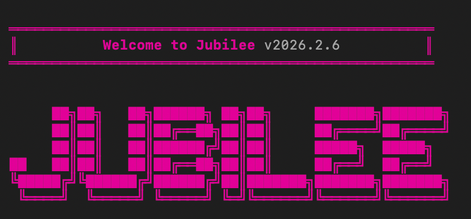

# Jubilee OS 🕊️



**Jubilee OS** is an AI co-builder — a sovereign, model-interchangeable operating system that researches, codes, tests, and stewards resources alongside you.

> **"Stewardship over Speculation"** — Built for long-term builders, not short-term traders.

---

## ⚡ Quick Start (3 minutes)

```bash
# 1. Clone
git clone https://github.com/Jubilee-Protocol/jubilee-agent.git
cd jubilee-agent

# 2. Install
bun install

# 3. Configure (set at least one LLM key)
cp env.example .env
# Edit .env → set GOOGLE_API_KEY, OPENAI_API_KEY, or ANTHROPIC_API_KEY

# 4. Run
bun start
```

That's it. No Docker, no database, no external services required. Chat with your agent immediately.

### Full Stack (Web UI + Database)

```bash
docker compose up --build
```

- **The Steward (UI)**: [http://localhost:3000](http://localhost:3000)
- **The Voice (API)**: [http://localhost:3001](http://localhost:3001)

---

## 🏗️ What Is Jubilee OS?

Jubilee OS is a **Triune AI Operating System** that can:

- 🔭 **Research** markets, protocols, and competitors
- 🔨 **Write and test** smart contracts (Solidity, Anchor, Rust)
- ⚖️ **Review** compliance, audits, and governance proposals
- 💰 **Manage** treasury operations and multi-sig wallets
- 📋 **Track** multi-day sprints across sessions
- 🏛️ **Govern** via Safe (EVM) and Squads (Solana) multi-sig

It's model-interchangeable — swap between Gemini, GPT-4, Claude, Grok, or local models (Ollama) at any time.

> **Attribution**: Built upon the excellent [Dexter](https://github.com/virattt/dexter) framework by [Virat](https://twitter.com/virattt). Adapter and orchestration patterns inspired by [Paperclip](https://github.com/paperclipai/paperclip) (MIT).

---

## 🧠 Architecture

### The Triune (Core Agents)

| Agent | Role | Tools |
|-------|------|-------|
| **The Mind** 🧠 | Research & analysis | Search, browser, financial data, codebase search |
| **The Prophet** 👁️ | Strategy & ethics | Trend analysis, mission vetting, safety guard |
| **The Will** ⚡ | Execution | All tools — treasury, coding, deployment, governance |

### The Angel Swarm (13 Specialist Agents)

Dispatch specialized angels organized by department. Each angel auto-injects its department's MCP servers at dispatch time.

#### Engineering
| Angel | Domain | MCP Servers |
|-------|--------|-------------|
| 🔨 **ContractAngel** | Smart contract dev, testing, auditing | openclaw, github |
| 🏗️ **BuilderAngel** | Full-stack dev, API integrations | openclaw, github |
| ⚙️ **SystemAngel** | DevOps, CI/CD, infrastructure | openclaw, github |

#### Architecture
| Angel | Domain | MCP Servers |
|-------|--------|-------------|
| 📜 **DocsAngel** | Technical docs, whitepaper, proposals | openclaw, github |
| ⚖️ **ComplianceAngel** | Regulatory, FASB, legal review | openclaw, github |

#### Marketing / BD
| Angel | Domain | MCP Servers |
|-------|--------|-------------|
| 📣 **GrowthAngel** | Community, partnerships, outreach | coingecko, coinmarketcap |
| 📱 **SocialAngel** | Social media, daily posts, content | coingecko, coinmarketcap |
| 🤝 **CommunityAngel** | Member support, FAQ, engagement | coingecko, coinmarketcap |

#### Tokenomics
| Angel | Domain | MCP Servers |
|-------|--------|-------------|
| 💰 **TreasuryAngel** | Yield optimization, vault health | coingecko, dune, helius |
| 🔭 **ResearchAngel** | DeFi research, market analysis | coingecko, dune, helius |
| 🪙 **TokenAngel** | Supply analysis, vesting, liquidity | coingecko, dune, helius |

#### Governance & Pastoral
| Angel | Domain | MCP Servers |
|-------|--------|-------------|
| 🏛️ **GovernanceAngel** | Safe/Squads multi-sig, council voting | openclaw, github |
| 🕊️ **PastoralAngel** | Scripture study, sermon prep, care | — (bible + memory) |

Angels can run tests autonomously (`forge test`, `bun test`, `anchor build`) and iterate on failures.

Override any angel's model backend via `~/.jubilee/architect.json`:

```json
{ "angelArchetypes": { "ContractAngel": { "preferredAdapter": "claude" } } }
```

See [AGENT_MAP.md](AGENT_MAP.md) for the full department → angel → MCP routing reference.

---

## 🔀 Dual Modes

Jubilee OS operates in two modes that can be enabled independently:

### Stewardship Mode (Default)
For treasury managers, researchers, and operators.
- Treasury management (deposit, withdraw, yield)
- Financial research and compliance
- War room reports
- Memory and knowledge management

### Builder Mode (Opt-in)
For developers building alongside the agent.
- Smart contract workflows (Foundry, Anchor)
- Code execution sandbox (30+ allowed commands)
- GitHub MCP integration (issues, PRs, branches)
- Protocol state tracking
- Multi-sig governance (Safe + Squads)

Enable Builder mode:
```
config.setMode('builder', true)
```

---

## 📦 Installation

### Prerequisites

| Requirement | Purpose | Required? |
|------------|---------|-----------|
| [Bun](https://bun.sh) v1.0+ | Runtime | ✅ Yes |
| LLM API key | AI provider | ✅ Yes (at least one) |
| PostgreSQL | Long-term memory, tasks | Optional |
| [Foundry](https://getfoundry.sh) | Smart contract testing | Builder mode only |
| [Anchor](https://www.anchor-lang.com) | Solana development | Builder mode only |

### Supported LLM Providers

| Provider | Env Variable | Models |
|----------|-------------|--------|
| Google Gemini | `GOOGLE_API_KEY` | gemini-2.0-flash, gemini-2.5-pro |
| OpenAI | `OPENAI_API_KEY` | gpt-4o, gpt-4-turbo |
| Anthropic | `ANTHROPIC_API_KEY` | claude-sonnet-4, claude-3.5-sonnet |
| xAI | `XAI_API_KEY` | grok-3, grok-2 |
| OpenRouter | `OPENROUTER_API_KEY` | Access 100+ models |
| Ollama | `OLLAMA_BASE_URL` | Local models (deepseek, llama) |

### Step-by-Step

```bash
# Clone with submodules
git clone --recurse-submodules https://github.com/Jubilee-Protocol/jubilee-agent.git
cd jubilee-agent

# Install dependencies
bun install

# Configure environment
cp env.example .env
# Edit .env with your preferred editor

# (Optional) Set up treasury keys
bun scripts/setup_treasury.ts

# (Optional) Set up architect identity
cp architect.example.json ~/.jubilee/architect.json
# Edit with your protocol-specific context

# Run
bun start
```

### Docker (Full Stack)

```bash
cp env.example .env
# Edit .env with your API keys
docker compose up --build
```

Postgres + pgvector are provisioned automatically. Access the UI at `localhost:3000`.

---

## 🛠️ Builder Mode Setup

For developers who want the full co-builder experience:

```bash
# 1. Enable builder mode
# In the CLI: config.setMode('builder', true)

# 2. (Optional) Install governance SDKs
bun add @safe-global/protocol-kit @safe-global/api-kit   # EVM multi-sig
bun add @sqds/multisig                                    # Solana multi-sig

# 3. (Optional) Set governance keys in .env
GITHUB_PERSONAL_ACCESS_TOKEN=your-token
SAFE_SIGNER_KEY=your-safe-signer-key
SQUADS_SIGNER_KEY=your-squads-signer-key

# 4. (Optional) Push DB schema for sprint tracking
bun run db:push
```

### Code Execution Sandbox

Builder and Contract Angels can run shell commands autonomously. Safety guardrails:

**Allowed**: `forge`, `cast`, `anvil`, `slither`, `bun`, `npx`, `node`, `tsc`, `anchor`, `solana`, `cargo`, `git`, `npm`, `cat`, `ls`, `grep`, `find`

**Blocked**: `rm -rf`, `sudo`, `curl | bash`, `git push`, `git merge`, `npm publish`, `DROP TABLE`

---

## 📋 Sprint Tracking

Jubilee OS maintains persistent task memory across sessions:

```
> create task "Build Jubilee Lending LTV Module" --priority high --assign ContractAngel
✅ Task #1 created

> dispatch_angel ContractAngel --task_id 1 --mission "Implement the LTV calculation..."
🔨 [Contract Angel] Loading previous context... executing...

> query_tasks
## Sprint Board
### 🔨 Active (1)
- 🟧 #1 Build Jubilee Lending LTV Module → ContractAngel
```

Angels auto-save their results. Next session, they pick up where they left off (capped at last 5 session summaries).

---

## 🏛️ Multi-Chain Governance

| Chain | Platform | Tools |
|-------|----------|-------|
| Base / Ethereum | Safe (Gnosis Safe) | `propose_safe_tx`, `query_safe_status` |
| Solana | Squads | `propose_squads_tx`, `query_squads_status` |

The GovernanceAngel manages ceremony: proposing transactions, tracking signer confirmations, and monitoring 24-hour timelocks.

---

## 🔐 Security

- **Prophet Guard**: Every angel mission is ethically vetted before execution
- **Double Confirmation**: Sensitive actions (transfers, shell commands) require explicit approval
- **Treasury Whitelist**: Transfers only to approved addresses
- **Code Sandbox**: Only allowlisted commands can be executed
- **Private Config**: Protocol-specific identity lives in `~/.jubilee/` (gitignored)
- **AgentKit Suppression**: Debug output from treasury SDK is suppressed to prevent key leaks

---

## ⚡ Adapter Interface

Angels run on a model-agnostic adapter layer. Swap the underlying LLM without changing agent logic.

| Adapter | Provider | Cost Tracking | Status |
|---------|----------|--------------|--------|
| `gemini` | Google Gemini | ✅ | Default |
| `claude` | Anthropic Claude | ✅ | Requires `ANTHROPIC_API_KEY` |
| `ollama` | Local self-hosted | Free ($0) | Requires Ollama running |

```bash
# Check adapter connections
bun run sprint adapters

# Inside the interactive CLI
/adapters
```

---

## 📋 Sprint Runner

Run multiple angels concurrently with budget tracking and real-time progress.

```bash
# List available angel roles
bun run sprint roles

# Create and auto-run a sprint
bun run sprint create "Protocol Audit" \
  --tasks "ContractAngel:Audit vault,DocsAngel:Update README" \
  --budget 2.50 --concurrency 2 --run

# Check sprint status
bun run sprint status

# Inside the interactive CLI
/sprint
```

**Features:**
- Concurrent angel dispatch with configurable parallelism
- Per-angel cost and token tracking
- Budget limits with auto-cancel when exceeded
- Per-provider cost breakdowns

---

## 📁 Project Structure

```
jubilee-agent/
├── src/
│   ├── adapters/        # Model-agnostic LLM adapters
│   ├── agent/           # Triune agent architecture
│   ├── config/          # Settings, angel roles (13 roles, 6 departments)
│   ├── db/              # Drizzle ORM schema (logs, memories, tasks, protocol_state)
│   ├── mcp/             # MCP manager + clients (6 servers)
│   ├── model/           # Multi-provider LLM manager
│   ├── services/        # Sprint board, budget tracking
│   ├── skills/          # Skill modules (auto-discovered SKILL.md)
│   │   ├── architect/          # Architect skill (public template)
│   │   ├── social-posting/     # Daily Scripture + metrics posts
│   │   │   ├── SKILL.md        # Skill definition
│   │   │   └── post-generator.ts  # 365-verse post generator
│   │   └── jubilee/            # OpenClaw Jubilee Skill (submodule)
│   ├── tools/           # All agent tools
│   │   ├── angel-tool.ts       # Dispatch with dept MCP injection
│   │   ├── code-exec-tool.ts   # Sandboxed shell execution
│   │   ├── governance-tools.ts # Safe + Squads multi-sig
│   │   └── registry.ts         # Tool registration + mode gating
│   ├── sprint-runner.ts # Standalone sprint CLI
│   └── utils/           # Logger, helpers
├── AGENT_MAP.md            # Department → Angel → MCP routing
├── mcp.json                # MCP server configuration (6 servers)
├── docker-compose.yml      # Full stack deployment
└── env.example             # All environment variables
```

---

## 🔧 Configuration Reference

| Variable | Purpose | Required |
|----------|---------|----------|
| `GOOGLE_API_KEY` | Gemini models | One LLM key required |
| `OPENAI_API_KEY` | OpenAI models | One LLM key required |
| `ANTHROPIC_API_KEY` | Anthropic models | One LLM key required |
| `OPENROUTER_API_KEY` | OpenRouter (100+ models) | One LLM key required |
| `DATABASE_URL` | PostgreSQL connection | Optional (enables memory + tasks) |
| `CDP_API_KEY_NAME` | Coinbase treasury | Optional |
| `GITHUB_PAT` | GitHub MCP (Builder mode) | Optional |
| `HELIUS_API_KEY` | Solana RPC + DAS (Tokenomics dept) | Optional |
| `COINGECKO_API_KEY` | Crypto prices + TVL (Marketing/Tokenomics) | Optional |
| `CMC_API_KEY` | CoinMarketCap data (Marketing) | Optional |
| `DUNE_API_KEY` | On-chain analytics (Tokenomics) | Optional |
| `SAFE_SIGNER_KEY` | Safe multi-sig (Builder mode) | Optional |
| `SQUADS_SIGNER_KEY` | Squads multi-sig (Builder mode) | Optional |

---

## 💛 Support the Mission

Jubilee OS is open source and built as a labor of love.

[](https://commerce.coinbase.com/checkout/122a2979-e559-44b9-bb9d-2ff0c6a3025b)

> *"Each of you should give what you have decided in your heart to give, not reluctantly or under compulsion, for God loves a cheerful giver."* — 2 Corinthians 9:7

---

## 🤝 Contributing

We welcome contributions! Fork the repo and submit a PR.

## 📄 License

MIT License

---

> *"Consecrate the fiftieth year and proclaim liberty throughout the land to all its inhabitants. It shall be a jubilee for you."* — Leviticus 25:10
